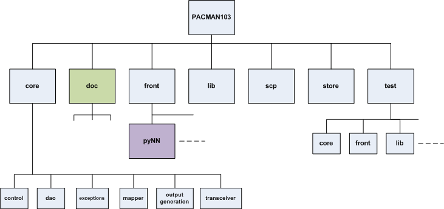

File Structure
--------------

The figure below shows the directory tree for the PACMAN103 files. Unless
otherwise noted, all files are written in Python.

   Top-level directory structure for PACMAN103

The top-level directories partiton the major task of PACMAN:

* **core:** Contains the principle components of PACMAN, mapping the user's
  design to the SpiNNaker machine, generating the binary files and managing
  communications with the machine during set-up and simulation.

* **front:** Contains one directory for each front-end application. These 
  sub-directories contain application-specific code to translate the user's
  design into PACMAN's internal (graph-based) format. Currently, we support
  pyNN and the heat demo as front-ends.

* **lib** Contains library files defining and describing internal data 
  structures that are used by PACMAN, including graph elements, 
  processors, chips and data capturing placement and routing information.

* **scp:** Contains a transceiver module that is instantiated at run-time
  to interface the host with the target spiNNaker machine.

* **store:** Contains two types of library information: application-specific
  libraries (such as for spiking NNs, describing different neuron model 
  constraints) and machine-specific (describing the size and known faults of
  individual spiNNaker boards and systems).

* **test:** Contains a regression test environment and a suite of regression
  tests to be run by users to check for correct tools installation.

* **doc:** Contains documentation for PACMAN103 and SpiNNaker. The file are
  in html format, although the input format for documentation generation uses
  Sphinx 1.0.8.

