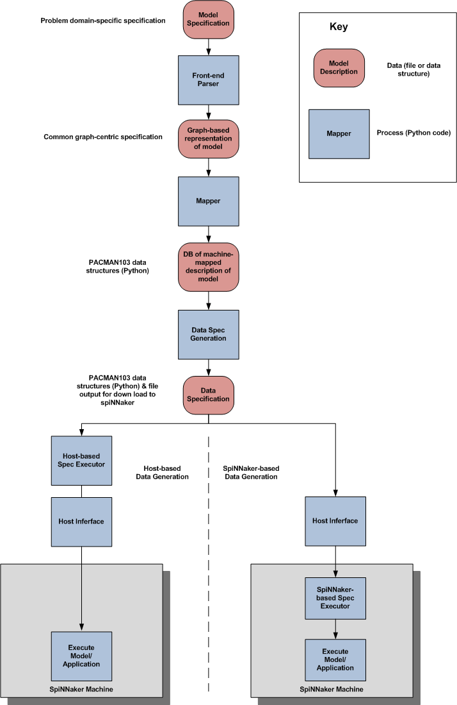
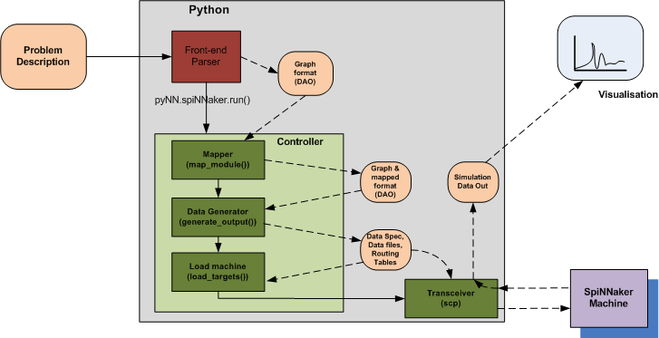

Program Flow
------------

The figure below shows the essential dataflow for PACMAN103, indicating the
major tasks that it carries out. In the figure, pink rounded rectangles indicate
the inputs and outputs of each process, while the blue rectangles represent the
processes, themselves.

   High-level view of the PACMAN103 flow

The next section provides details on each of the major modules. Here we provide only
a summary of each process in the chain. It is worth noting that this diagram omits
many of the support functions, such as the *controller* and the data access object
(the *dao*).

The major steps in the flow are as follows:

* **Problem specification:** coded using in a domain-specific language, such as pyNN.

* **Front-end parser:** This process converts the problem specification to an internal
  format that is based on graph representation consisting of vertices and edges. Vertices
  represent tasks that have both compute and memory constraints. Edges represent 
  communication between these parallel tasks. User constraints can be specified for both
  vertices and edges as required.

* **Mapper:** This performs a number of steps, including partitioning the computational
  and data storage tasks into chunks small enough to fit on one core (*partitioning*),
  selecting which core each task will be mapped to (*placement*) and selecting the
  path that message should take from each source of data to each destination - as specified
  by the edges of graph derived from the user's model (*routing*).

* **Data Spec Generation:** For each core in the machine required to run the application,
  this process generates a set of instructions (the *Data Spec*) that tell it what data
  structures to build and what shared components (executables and library files) to load
  during the configuration phase.

There are two possible choices for the next phase of PACMAN103, depending on
where the actuall generation of the data files takes place.

* **Host-based generation:** In this model, the host creates all of the data
  files, as happens with our original PACMAN tools. These files are then loaded
  one-by-one to the machine (via the *Host Interface*). This method is supported today.

* **On-chip generation:** In this model, only the *Data Spec* for each core is sent
  the core itself. A special application (the *Spec Executor*) is running on each
  core and this executes the Data Spec and creates the required data structures
  locally. Shared code and libraries are broadcast only once across the machine 
  and each core will either grab or ignore each component depending on the 
  instructions in its Data Spec. This is the intended long-term method of
  creating data structures, but is not yet ready for deployment.

The on-chip method should drastically reduce the quantity of data that must be 
transferred to the machine at load-time, since the data structures themselves
are typically highly redundant. 

Program Structure
*****************

The figure below shows the flow of data within PACMAN103 with reference to
the modules and files that provide the functionality. The diagram assumes
the pyNN front-end, which is unusual in that the user includes a call to the
pyNN.spinnaker library in their pyNN code and this invokes PACMAN103.

   PACMAN103 structure referencing modules and files

Details of each module and its interfaces can be found here <module interfaces link>.

